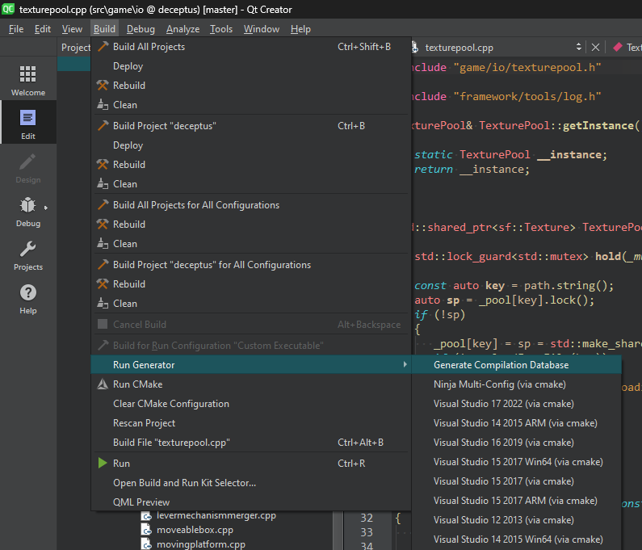

# clang-tidy-gui

## Introduction

`clang-tidy-gui` is a simple UI for `run-clang-tidy.py` that invokes the underlying script for each selected patch.
It does so in a sequential manner to avoid conflicting changes.

## How to produce a `compile_commands.json`?

### Qt Creator

